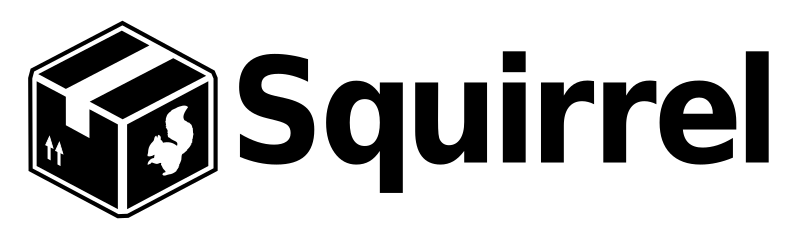

| README.md |
|:---|

# Contributors Needed

We are looking for help with maintaining this important project - please read the discussion in [#1470](https://github.com/Squirrel/Squirrel.Windows/issues/1470) for more information.

---

# Squirrel: It's like ClickOnce but Works™



[](https://dev.azure.com/squirrel-installers/Squirrel.Windows/_build/latest?definitionId=1&branchName=master)

Squirrel is both a set of tools and a library, to completely manage both installation and updating your Desktop Windows application, written in either C# or any other language (i.e., Squirrel can manage native C++ applications).

Squirrel uses NuGet packages to create installation and update packages, which means that you probably already know most of what you need to create an installer.

## What Do We Want?

Windows apps should be as fast and as easy to install and update as apps like Google Chrome. From an app developer's side, it should be really straightforward to create an installer for my app, and publish updates to it, without having to jump through insane hoops. 

* **Integrating** an app to use Squirrel should be extremely easy, provide a client API, and be developer friendly.
* **Packaging** is really easy, can be automated, and supports delta update packages.
* **Distributing** should be straightforward, use simple HTTP updates, and provide multiple "channels" (a-la Chrome Dev/Beta/Release).
* **Installing** is Wizard-Free™, with no UAC dialogs, does not require reboot, and is .NET Framework friendly.
* **Updating** is in the background, doesn't interrupt the user, and does not require a reboot.

Refer to our full list of goals for [integrating, packaging, distributing, installing, and updating](docs/goals.md).

## Documentation

See the documentation [Table of Contents](docs/readme.md) for an overview of the available documentation for Squirrel.Windows. It includes a [Getting Started Guide](docs/getting-started/0-overview.md) as well as additional topics related to using Squirrel in your applications. 

## Building Squirrel
For the impatient:

```sh
git clone --recursive https://github.com/squirrel/squirrel.windows
cd squirrel.windows
.\.NuGet\NuGet.exe restore
msbuild /p:Configuration=Release
```
See [Contributing](docs/contributing/contributing.md) for additional information on building and contributing to Squirrel.


## License and Usage

See [COPYING](COPYING) for details on copyright and usage of the Squirrel.Windows software.


