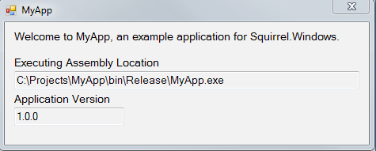

| [docs](..) / [getting-started](.) / 0-overview.md|
|:---|

# Getting Started Guide

Getting Started will walk you through the integration of Squirrel.Windows for a basic c# Windows Forms application named MyApp.

## MyApp

MyApp simply displays the assembly location and application version on a simple form.

For simplicity, any unneeded references and files have been removed from the solution.

If you wish to follow along, you can [download](Example/MyApp.zip) a zip file of the MyApp solution.

## Overview
This guide will go over the following steps to demonstrate using Squirrel.Windows to distribute and update MyApp.

1. [Integrating](1-integrating.md) - integrating Squirrel `UpdateManager` into your application.
1. [Packaging](2-packaging.md) - packaging application files and preparing them for release.
1. [Distributing](3-distributing.md) - providing install and update files for users.
1. [Installing](4-installing.md) - process of initial installation of your application.
1. [Updating](5-updating.md) - process of updating an existing install.

---
| Next: [1. Integrating](1-integrating.md)|
|:---|

