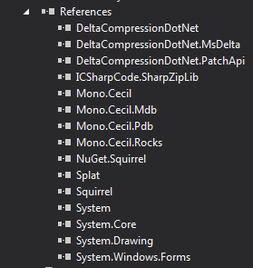

| [docs](..) / [getting-started](.) / 1-integrating.md |
|:---|

# Step 1. Integrating

The first step is to configure MyApp to work with Squirrel.Windows. This requires you to install the Squirrel.Windows NuGet Package into the `MyApp.sln`.

## Installing Squirrel.Windows

The easiest way to install the Squirrel.Windows is using the [Package Manager Console](https://docs.NuGet.org/consume/package-manager-console) in Visual Studio after loading the MyApp solution.

~~~powershell
PM> Install-Package Squirrel.Windows
~~~

### Squirrel.Windows References

The package will install a number of dependent packages as well as tools that will be used to prepare MyApp to be released. The References in the Solution Explorer of the MyApp project now looks like the following (as of Squirrel.Windows version 1.2.2):

**Tip:** Alternatively, you can use the "Manage NuGet Packages" GUI to install Squirrel.Windows (right clicking on your project in the Solution Explorer of Visual Studio and select "Manage NuGet Packages..."). 

## Basic Updating

For the basic example we are going to have MyApp update from your local file system rather than distributing the files via the web.  See section [Packaging](2-packaging.md) for additional options related to the distributing the update files.

### Basic Squirrel.Windows Update Code
The following code is added to MyApp `Program.cs` to cause the application to check for, download, and install any new releases of MyApp in the background while you use the application. 

**`Program.cs`**

~~~cs
using Squirrel;
~~~

**`static void Main()`**

~~~cs
using (var mgr = new UpdateManager("C:\\Projects\\MyApp\\Releases"))
{
    await mgr.UpdateApp();
}
~~~

The code above demonstrates the most basic update mechanism using the `UpdateApp()` method in an asynchronous task. The actions it takes will be discussed further in section [Updating](5-updating.md).

**Caution:** The path you provide the `UpdateManager` is the path to the directory where the `RELEASES` file is located (which is also named `Releases` by default), and not the actual `RELEASES` file.

**Tip:** By default, the files for updating MyApp will be placed in the same directory as your `MyApp.sln` file under a `Releases` directory (e.g., `C:\Projects\MyApp\Releases`).

**Tip:** In this example we simply put the code in the `Program.cs` file. For a production application, place the update code later in start-up process so as to avoid slowing down your program start. 

**Tip:** If you attempt to debug the application via Visual Studio, you will get an exception of `Update.exe not found, not a Squirrel-installed app?`. You can resolve this by placing a copy of the Update.exe in your bin directory (see [Debugging Updates: Update.exe not found?](../using/debugging-updates.md) section for details).

---
| Previous: [Getting Started Guide](0-overview.md) | Next: [2. Packaging](2-packaging.md)|
|:---|:---|
