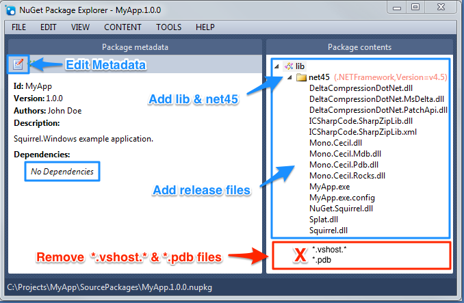
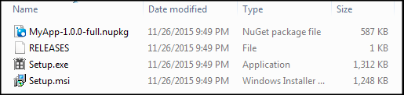

| [docs](..) / [getting-started](.) / 2-packaging.md |
|:---|

# Step 2. Packaging

Packaging is the process of building, packing, and preparing MyApp release packages for distribution.

## Building

The first step in preparing the application for distribution is to build the application. 

1. **Set MyApp Version** - set the initial application version.
 
   	**`Properties\AssemblyInfo.cs`**
   
   	~~~cs
  	[assembly: AssemblyVersion("1.0.0")]
	[assembly: AssemblyFileVersion("1.0.0")]
   	~~~
2. **Switch to Release** - switch your build configuration to `Release`.
3. **Build MyApp** - build your application to ensure the latest changes are included in the package we will be creating.

## Packing

Squirrel uses [NuGet](https://www.NuGet.org/) for bundling application files and various application properties (e.g., application name, version, description) in a single release package.

Section [NuGet Package Metadata](../using/nuget-package-metadata.md) provides additional details on using NuGet and `.nuspec` files to automate the packing of your application. We will be going through the process using the [NuGet Package Explorer](https://github.com/NuGetPackageExplorer/NuGetPackageExplorer) to manually create a NuGet package.

1. **Creating a New NuGet Package** - the first step is to create a new NuGet package.
2. **Edit Metadata** - update package metadata for MyApp.
   * **Id** - name of the application (no spaces)
   * **Version** - version specified in `Properties\Assembly.cs`
   * **Dependencies** - Squirrel expects no dependencies in the package (all files should be explicitly added to the package)
3. **Add lib & net45** - add the `lib` folder and the `net45` folder to the project. Squirrel is expecting a single `lib / net45` directory provided regardless of whether your app is a `net45` application.
4. **Add Release Files** - add all the files from `bin\Release` needed by MyApp to execute (including the various files required by Squirrel).
   * **Include MyApp Files:** MyApp.exe, MyApp.exe.config, any non-standard .NET dll's needed by MyApp.exe.
   * **Include Squirrel Files:** Squirrel.dll, Splat.dll, NuGet.Squirrel.dll, Mono.Cecil.\*, DeltaCompressionDotNet.\*,
   * **Exclude:** *.vshost.\*, *.pdb files 
5. **Save the NuGet Package File** - save the NuGet package file to where you can easily access later (e.g., `MyApp.sln` directory). Follow the given naming format (e.g., `MyApp.1.0.0.nupkg`).
 

## Releasifying

Releasifying is the process of preparing the `MyApp.1.0.0.nupkg` for distribution. 

### Using Releasify

You use the `Squirrel.exe` tool that was included in the Squirrel.Windows package you installed in the `MyApp.sln` previously. 

Use the [Package Manager Console](https://docs.NuGet.org/consume/package-manager-console) to execute `Squirrel.exe --releasify` command.

~~~powershell
PM> Squirrel --releasify MyApp.1.0.0.nupkg
~~~ 

**Tip:** If you get an error stating that `...'Squirrel' is not recognized...` then you may simply need to restart Visual Studio so the `Package Manager Console` will have loaded all the package tools.

### Releasify Output

The `Squirrel --releasify` command completes the following:

* **Create `Releases` Directory** - creates a Releases directory (in the `MyApp.sln` directory by default). 
* **Create `Setup.exe`** - creates a `Setup.exe` file which includes the latest version of the application to be installed.
* **Create `RELEASES` File** - creates a file that provides a list of all release files for MyApp to be used during the update process
* **Create `MyApp.1.0.0-full.nupkg`** - copies the package you created to the `Releases` directory.
* **Create `MyApp.*.*.*-delta.nupkg`** - if you are releasing an update, releasify creates a delta file package to reduce the update package size (see [Updating](5-updating.md) for details).

**`C:\Projects\MyApp\Releases`**

## See Also

* [Visual Studio Build Packaging](../using/visual-studio-packaging.md) - integrating NuGet packaging into your visual studio build process to include packing and releasifying.

---
| Previous: [1. Integrating](1-integrating.md) | Next: [3. Distributing](3-distributing.md)|
|:---|:---|
