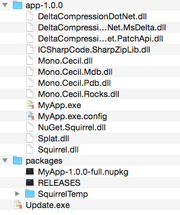

| [docs](..) / [getting-started](.) / 4-installing.md |
|:---|
# Step 4. Installing

The process to install MyApp is as simple as executing the `Setup.exe` application. `Setup.exe` is generated by the `Squirrel --releasify` process and is located in the `Releases` directory. 

## Setup.exe

`Setup.exe` is a C++ bootstrapper application used to install MyApp on the user's local system. It includes the latest full version of the MyApp package files embedded in the exe file (see [Install Process](../using/install-process.md) for details).

## Install Process Overview

The `Setup.exe` application does the following (see [Install Process](../using/install-process.md) for details):

* Creates a `%LocalAppData%\MyApp` directory for the MyApp to be installed.
* Extracts and prepares the MyApp files under an `app-1.0.0` directory.
* Launches `app-1.0.0\MyApp.exe` at the end of the setup process.

### Installed File Structure

An installation for MyApp will look like the following after the initial installation. 

#### `%LocalAppData%\MyApp` Directory

---
| Previous: [3. Distributing](3-distributing.md) | Next: [5. Updating](5-updating.md)|
|:---|:---|

