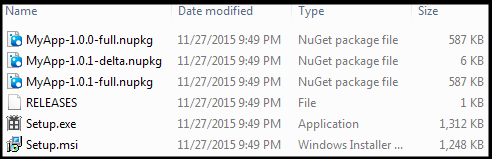
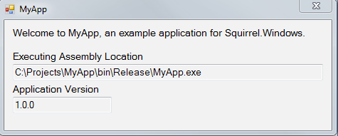
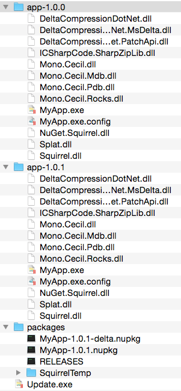
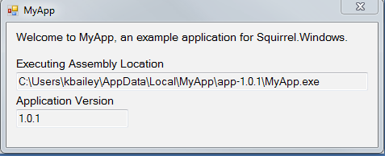

| [docs](..) / [getting-started](.) / 5-updating.md |
|:---|

# Step 5. Updating

The update process uses the update files generated by the `Squirrel --releasify` process. This includes the `RELEASES` file as well as versioned full and delta packages as required. The location of where to look for the distributed update files is provided to the `UpdateManager` in the MyApp code (see code in [Integrating: Basic Updating](1-integrating.md)). 

Updating MyApp to a new version is the culmination of integrating, packaging, and distributing after installing MyApp. The process will cause you to revisit the packaging and distributing steps.
HH

To release a new update, you must first build, pack, and releasify your updated application.

### Building

1. **Update MyApp Version** - update the application version.
 
   	**`Properties\AssemblyInfo.cs`**
   
   	~~~cs
  	[assembly: AssemblyVersion("1.0.1")]
	[assembly: AssemblyFileVersion("1.0.1")]
   	~~~
2. **Switch to Release** - switch your build configuration to `Release`.
3. **Build MyApp** - build your application to ensure the latest changes are included in the package we will be creating.

### Packing

Using [NuGet Package Explorer](https://npe.codeplex.com/) complete the following:

1. **Open Previous NuGet Package** - open the previous NuGet package you created for MyApp version 1.0.0.
2. **Update Version** - update the version in the metadata.
4. **Replace Release Files** - replace the changed files under `lib\net45`. You can simply drag and drop any program specific files that have changed (i.e., the `MyApp.exe` file is the only one that has updated in the example). 
5. **Save the NuGet Package File as New Version** - use the "Save As..." feature to save the new version of the package `MyApp.1.0.1.nupkg`.

### Releasifying

Use the [Package Manager Console](https://docs.NuGet.org/consume/package-manager-console) to execute `Squirrel.exe --releasify` command using the new  `MyApp.1.0.1.nupkg` package.

~~~powershell
PM> Squirrel --releasify MyApp.1.0.1.nupkg
~~~ 

**Tip:** If you get an error stating that `...'Squirrel' is not recognized...` then you may simply need to restart Visual Studio so the `Package Manager Console` will have loaded all the package tools. This behavior has been seen on the Community Edition of VS 2013 and 2015.

#### Releasify Output

After packaging the new MyApp version 1.0.1, the `Releases` directory has been updated as follows: 
 
* **Updated Setup Application** - the `Setup.exe` application has been updated to include the latest MyApp version 1.0.1 package.
* **Updated Files** - the `RELEASES` file has been appended to include the newly created full and delta packages.

## Distributing the New Release

The `Releases` directory now includes the updated files to distribute to your users. 

**`Releases` Directory**

The `RELEASES` file contains SHA1 hash, filename, and file size for each package. This information is utilized by the application update process. 

**`RELEASES` File**

~~~
E3F67244E4166A65310C816221A12685C83F8E6F MyApp-1.0.0-full.nupkg 600725
0D777EA94C612E8BF1EA7379164CAEFBA6E24463 MyApp-1.0.1-delta.nupkg 6030
85F4D657F8424DD437D1B33CC4511EA7AD86B1A7 MyApp-1.0.1-full.nupkg 600752
~~~

## Application Updating

In [Step 1. Integrating](1-integrating.md), we configured MyApp to look for and install any updates in the background each time MyApp is executed. In the MyApp example, a path to the `Releases` directory on the file system was specified. 

### Updating Process Overview

The following steps are performed by the `UpdateManager` each time MyApp is executed (see [Update Process](../using/update-process.md) for details):

* The `UpdateManager` checks the `RELEASES` file at the distribution location for any updates.
* Any update packages are downloaded and the new MyApp is prepared for execution. 
* App shortcuts are updated and old versions of MyApp are cleaned up.

### MyApp Example

The first time I run MyApp after providing the update the application is executed like normal.

In the background, MyApp has obtained and applied the updates in the installation directory.

The next time MyApp is executed, it will be the newly installed version.

---
| Previous: [4. Installing](4-installing.md) | Return: [Table of Contents](../readme.md)|
|:---|:---|

