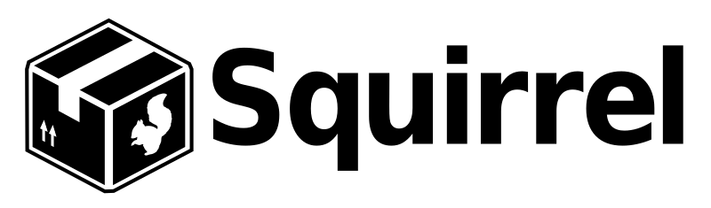

| [docs](.) / readme.md |
|:---|

# Table of Contents

This document provides a table of contents for all the Squirrel documentation.

## General Documentation

* **[Squirrel Goals](goals.md)** - overview of the goals of the Squirrel.Windows project.
* **[Frequently Asked Questions (FAQ)](faq.md)** - list of frequently asked questions.
* **[Squirrel.Windows License](../COPYING)** - copyright and license for using Squirrel.Windows

## Getting Started Guide

The **[Getting Started Guide](getting-started/0-overview.md)** provides a step-by-step guide for integrating Squirrel into a simple Windows Forms application named MyApp.

1. **[Integrating](getting-started/1-integrating.md)** - integrating Squirrel `UpdateManager` into MyApp.
1. **[Packaging](getting-started/2-packaging.md)** - packaging MyApp files and preparing them for release.
1. **[Distributing](getting-started/3-distributing.md)** - providing install and update files for MyApp.
1. **[Installing](getting-started/4-installing.md)** - process of initial installation of MyApp.
1. **[Updating](getting-started/5-updating.md)** - process of updating an existing install of MyApp.

## Using Squirrel

* **Installing** - documentation related to the initial installation of your application via Setup.exe (and Setup.msi).
  * [Install Process](using/install-process.md) - overview of the steps in the install process.
  * [Custom Squirrel Events](using/custom-squirrel-events.md) - preforming custom actions for Squirrel events.
  * [Custom Squirrel Events (non-c# apps)](using/custom-squirrel-events-non-cs.md) - steps on making a non-c# application Squirrel Aware and handling custom events.
  * [Loading GIF](using/loading-gif.md) - specify a "loading" image during initial install of large applications.
  * [GitHub](using/github.md) - overview of using GitHub for installing, distributing, and updating.
  * [Machine-wide Installs](using/machine-wide-installs.md) - generating an MSI file suitable for installation via Group Policy.
  * [Debugging Installs](using/debugging-installs.md) - tips for debugging Squirrel.Windows initial installs.
* **Packaging** - documentation related to packaging app files and preparing them for release.
  * [Naming Conventions](using/naming.md) - overview of sources used in naming (e.g., shortcut name).
  * [NuGet Package Metadata](using/nuget-package-metadata.md) - overview of the NuGet metadata and its uses by Squirrel.
  * [Packaging Tools](using/packaging-tools.md) - tools available to assist in the process of packaging your application (e.g., NuGet, OctoPack, Auto.Squirrel)
  * [Squirrel Command Line](using/squirrel-command-line.md) - command line options for `Squirrel --releasify`
  * [Delta Packages](using/delta-packages.md) - an overview of how `Squirrel.exe` creates delta packages.
  * [Application Signing](using/application-signing.md) - adding code signing to `Setup.exe` and your application.
* **Distributing** - documentation related to distributing the Setup.exe and update package files.
  * [Microsoft IIS](using/microsoft-iis.md) - overview of using Microsoft IIS for distributing your application.
  * [Amazon S3](using/amazon-s3.md) - overview of using Amazon S3 for distributing your application.
  * [GitHub](using/github.md) - overview of using GitHub for installing, distributing, and updating.
* **Updating** - documentation related to updating an existing install via the `UpdateManager`.
  * [Update Process](using/update-process.md) - overview of the steps in the update process.
  * [Update Manager](using/update-manager.md) - reference guide for the `UpdateManager`.  
  * [GitHub](using/github.md) - overview of using GitHub for installing, distributing, and updating.  
  * [Debugging Updates](using/debugging-updates.md) - tips for debugging Squirrel.Windows updates.
  * [Staged Rollouts](using/staged-rollouts.md) - how to use staged rollouts to ramp up install distribution over time

## Contributing

Why not give back and help make Squirrel even better by contributing to the project.

* [Contributing](../Contributing.md) - overview of ways you can become more involved with Squirrel.Windows.
* [Building Squirrel](contributing/building-squirrel.md) - steps to build squirrel for the impatient.
* [VS Solution Overview](contributing/vs-solution-overview.md) - overview of the various projects in the Squirrel.Windows Visual Studio solution.
