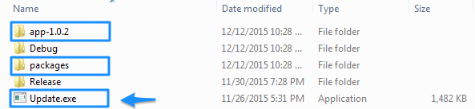

| [docs](..)  / [using](.) / debugging-updates.md
|:---|

# Debugging Updates

The following tips will help you to debug the update process in your application.

## Update.exe not found?

Executing MyApp from Visual Studio will execute the update process and you will get the following exception from the `UpdateManager`:

~~~
Update.exe not found, not a Squirrel-installed app?
~~~

The `UpdateManager` is expecting to find the `Update.exe` application installed one directory up from the EXE (e.g., the `\bin` directory for default Visual Studio projects). 

To resolve this, you can simply place a file named `Update.exe` or you can copy the `Squirrel.exe` from the `MyApp\packages\squirrel.windows.1.2.2.tools` directory and rename it Update.exe (this is the actual Update.exe packaged inside `Setup.exe`). 

Executing MyApp from Visual Studio will now cause it to complete the update process and your `\bin` directory will resemble the `%LocalAppData\MyApp%` install directory:

**Tip:** If you want to ensure that the Update.exe is always available in your output directory, you can add the Update.exe file to the Visual Studio project and set its Properties > Copy To Output Directory to 'Copy if newer'. 

## Catching Update Exceptions

You can catch thrown exceptions and log the results. 

~~~cs
using (var mgr = new UpdateManager("C:\\Projects\\MyApp\\Releases"))
{
    await mgr.UpdateApp();
}
~~~

Alternatively, set up Splat Logging, see [here](https://github.com/Squirrel/Squirrel.Windows.Next/blob/6d7ae23602a3d9a7636265403d42c1090260e6dc/src/Update/Program.cs#L53) for an example.

---
| Return: [Table of Contents](../readme.md) |
|----|
