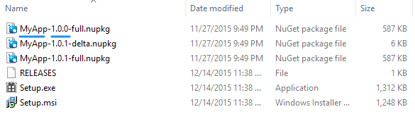

| [docs](..)  / [using](.) / naming.md
|:---|

# Naming Conventions

In addition to the [NuGet Package Metadata](nuget-package-metadata.md), there are other places that squirrel pulls naming information from. Here is the logic:

## Shortcut name

The shortcut name is selected from the first non-null item below:

1. `[assembly: AssemblyProduct("MyApp")` (from `AssemblyInfo.cs`)
2. Squirrel NuGet Package Metadata `title` property.
3. `[assembly: AssemblyDescription("MyApp")` (from `AssemblyInfo.cs`)
4. Filename of the Exe (e.g., MyApp)

## Local Install location

The local install location is determined by the `id` in the NuGet package metadata.

* `%LocalAppData%\<NuGet Package ID>`

**Warning:** Using \[dots\] (i.e., "."'s) in your package id will cause issues ([see issue #523](https://github.com/Squirrel/Squirrel.Windows/issues/523)).

## Program and Features Entry
The entry in the Windows Uninstall is determined as follows: 

* Squirrel NuGet Package Metadata `title` property

## Releases Folder

The `Squirrel --releasify` command will create update packages based on the following:

* `<NuGet Package ID>-<NuGet Package Version>-delta.nupkg`
* `<NuGet Package ID>-<NuGet Package Version>-full.nupkg`

## See Also

* [NuGet Package Metadata](nuget-package-metadata.md) - naming from the NuGet Package Metadata perspective.

---
| Return: [Table of Contents](../readme.md) |
|----|
