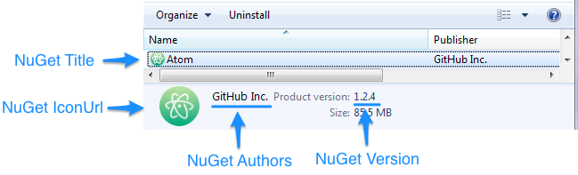

| [docs](..)  / [using](.) / nuget-package-metadata.md
|:---|

# NuGet Package Metadata

Squirrel uses information from your app's EXE as well as the NuGet package Metadata for the setup and uninstall UI.

* **Id** - name of the application (**warning:** you must **[avoid using spaces and dots](https://github.com/Squirrel/Squirrel.Windows/issues/523)** in the Id). 
   * Name of the release packages (e.g., **MyApp**-1.0.0-full.nupkg). 
   * Local installation directory (e.g., `%LocalAppData%\MyApp`).
* **Title** - used for the name of the application in the Windows Application Uninstaller.
* **Version** - version specified in `Properties\Assembly.cs`. 
   * Name of the release package (e.g., MyApp-**1.0.0**-full.nupkg).
   * Version number in the Windows Uninstaller (see screenshot below).
* **Icon Url** - url to an icon to be used for the application. Used for the shortcuts and Windows Uninstaller icons. This must be an icon file (*.ICO) to work correctly. Note that the icon is fetched at installation time rather than packaging (source: [issue #745](https://github.com/Squirrel/Squirrel.Windows/issues/745))

## See Also

* [Naming Conventions](naming.md) - overview of sources used naming (including those outside of the NuGet Package Metadata).

---
| Return: [Table of Contents](../readme.md) |
|----|
